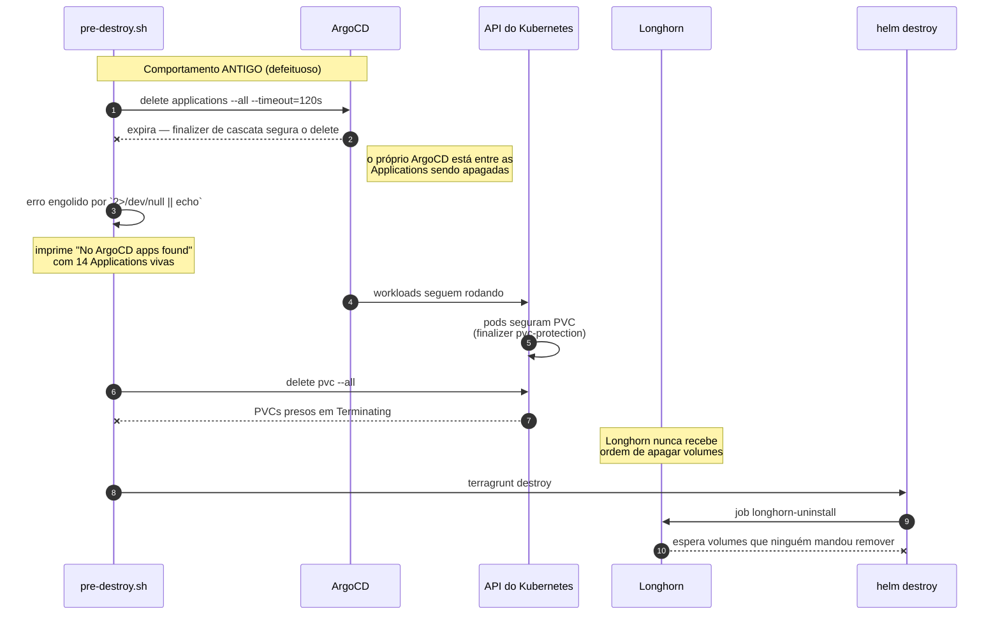
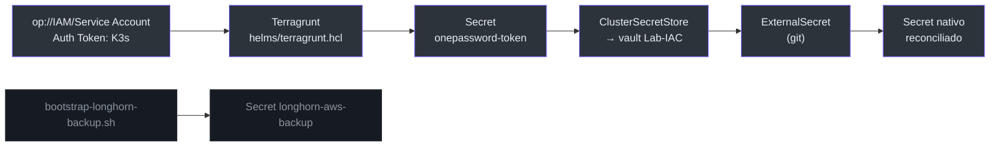

# Regulus — Ciclo de Vida do Cluster OCI K3s

Este documento descreve o caminho real de `deploy.sh destroy` e `deploy.sh deploy`
no cluster OCI Regulus, e registra sete defeitos encontrados ao validar esse
caminho de ponta a ponta em 30/08/2026.

O foco é o **porquê** de cada etapa existir. Várias delas parecem redundantes até
você ver o que quebra sem elas — e a maioria dos defeitos aqui não foi encontrada
lendo código, mas rodando o ciclo completo e observando onde ele mentia.

## Por onde começar a ler

| Perfil | Leia |
|---|---|
| Vai rodar um deploy hoje | [O ciclo em uma figura](#o-ciclo-em-uma-figura), depois [Invariantes](#invariantes-do-sistema) |
| Vai mexer no `pre-destroy.sh` | [A cadeia do destroy](#a-cadeia-causal-do-destroy) — ela é contraintuitiva |
| Vai subir versão de chart | [Upgrade da plataforma](#upgrade-da-plataforma) |
| Está debugando um destroy travado | [Defeito 4](#defeito-4--o-destroy-que-nunca-apagava-nada) e [Medições](#medições) |

---

## Upgrade da plataforma

O cluster foi de **K3s v1.33.1 → v1.36.4** (salto de três minors). Como a VM é
recriada do zero, não há caminho de upgrade in-place a respeitar: o `user_data`
instala a versão nova numa máquina limpa
(`oci/tenancy/regulus/us_ashburn_1/applications/compute/vm/terragrunt.hcl:12`).

As versões anteriores dos charts eram da era do Kubernetes 1.28–1.31, então
subiram junto:

| Chart | Antes | Depois |
|---|---|---|
| longhorn | 1.7.3 | **1.12.1** |
| argo-cd | 9.4.5 | **10.4.2** |
| cert-manager | v1.19.4 | **v1.21.1** |
| traefik | 39.0.2 | **41.4.0** |
| metallb | 0.14.8 | **0.16.1** |
| external-dns | 1.20.0 | **1.21.1** |

### Invariante: seed e ArgoCD sempre em par

Cada chart é declarado em **dois lugares**, e eles não podem divergir:

- O **seed** em Terraform — `organisms/oci/k3s/helms/main.tf:168` (longhorn),
  `:205` (argo-cd), `:141` (cert-manager), `:9` (metallb).
- A **Application do ArgoCD** —
  `oci/tenancy/regulus/us_ashburn_1/applications/k3s/argocd/apps/longhorn.yaml:15`,
  `argocd.yaml:15`, `traefik.yaml:15`, `external-dns.yaml:15`.

O seed instala a versão inicial; o ArgoCD assume a partir daí com `selfHeal`.
Se o seed apontar para uma versão e a Application para outra, o ArgoCD reverte o
seed no primeiro sync — e o sintoma é uma versão que "volta sozinha" depois de um
`terragrunt apply` aparentemente bem-sucedido.

> **Verificação barata antes de commitar:** renderizar cada chart com os values
> reais do repo pega quebra de schema em segundos.
> `helm template test <chart> --repo <url> --version <v> -f argocd/values/<chart>.yaml`

Foi assim que apareceu a única quebra do upgrade: o chart 41 do Traefik removeu
`logs.general.level` em favor de `log.level`
(`oci/tenancy/regulus/us_ashburn_1/applications/k3s/argocd/values/traefik.yaml:35-36`).
O render falhava na validação de schema antes de qualquer coisa chegar no cluster.

---

## O ciclo em uma figura

```mermaid
flowchart TD
    subgraph D["deploy.sh destroy"]
        D1["backup final do Minecraft<br/>falha fechada: aborta se não completar"]
        D2["remover finalizers +<br/>Applications do ArgoCD"]
        D3["derrubar workloads<br/>que montam PVC"]
        D4["apagar PVCs"]
        D5["esperar volumes Longhorn"]
        D6["terragrunt destroy dos helms"]
        D7["uninstall do K3s via SSH"]
        D8["destruir VM + volume"]
        D1 --> D2 --> D3 --> D4 --> D5 --> D6 --> D7 --> D8
    end

    subgraph P["deploy.sh deploy"]
        P1["provisionar VM<br/>user_data instala K3s"]
        P2["aguardar K3s Ready"]
        P3["configurar host via SSH<br/>monta volume de 100 GB"]
        P4["buscar kubeconfig"]
        P5["helms: metallb, cert-manager,<br/>longhorn, argocd"]
        P6["bootstrap de secrets"]
        P7["restaurar Minecraft<br/>do backup em S3"]
        P8["root app-of-apps"]
        P1 --> P2 --> P3 --> P4 --> P5 --> P6 --> P7 --> P8
    end

    D8 -.->|"estado no S3 sobrevive"| P1

    style D fill:#161b22,stroke:#30363d,color:#e6edf3
    style P fill:#161b22,stroke:#30363d,color:#e6edf3
    style D1 fill:#2d333b,stroke:#6d5dfc,color:#e6edf3
    style D2 fill:#2d333b,stroke:#6d5dfc,color:#e6edf3
    style D3 fill:#2d333b,stroke:#6d5dfc,color:#e6edf3
    style D4 fill:#2d333b,stroke:#6d5dfc,color:#e6edf3
    style D5 fill:#2d333b,stroke:#6d5dfc,color:#e6edf3
    style D6 fill:#2d333b,stroke:#6d5dfc,color:#e6edf3
    style D7 fill:#2d333b,stroke:#6d5dfc,color:#e6edf3
    style D8 fill:#2d333b,stroke:#6d5dfc,color:#e6edf3
    style P1 fill:#2d333b,stroke:#6d5dfc,color:#e6edf3
    style P2 fill:#2d333b,stroke:#6d5dfc,color:#e6edf3
    style P3 fill:#2d333b,stroke:#6d5dfc,color:#e6edf3
    style P4 fill:#2d333b,stroke:#6d5dfc,color:#e6edf3
    style P5 fill:#2d333b,stroke:#6d5dfc,color:#e6edf3
    style P6 fill:#2d333b,stroke:#6d5dfc,color:#e6edf3
    style P7 fill:#2d333b,stroke:#6d5dfc,color:#e6edf3
    style P8 fill:#2d333b,stroke:#6d5dfc,color:#e6edf3
```



A ordem do deploy não é arbitrária. `configure_regulus_host` roda **depois** de o
K3s estar Ready — o script para o serviço para copiar `/var/lib/longhorn` de forma
consistente — e **antes** dos helms, para o Longhorn já nascer sobre o volume
dedicado de 100 GB em vez do disco de boot
(`oci/tenancy/regulus/us_ashburn_1/applications/k3s/deploy.sh:305-311`).

---

## Invariantes do sistema

1. **O mundo do Minecraft nunca é apagado sem backup remoto confirmado.**
   O `pre-destroy` cria um Job, espera `condition=complete` e aborta o destroy
   inteiro se ele falhar
   (`oci/tenancy/regulus/us_ashburn_1/applications/k3s/pre-destroy.sh:16-36`).
   O backup vive em **AWS S3**, não na OCI — por isso sobrevive à destruição da
   tenancy inteira.

2. **O restore se recusa a criar volume vazio.** Se nenhum backup `Completed` for
   encontrado no catálogo, o deploy falha em vez de subir um mundo novo
   (`deploy.sh:196-200`). Entre múltiplos candidatos, escolhe o mais recente por
   `sort_by(.status.backupCreatedAt)` (`deploy.sh:187`) — o que importa quando o
   bucket acumula backups de várias gerações de volume.

3. **Longhorn precisa estar vivo durante o pre-destroy.** É ele quem processa a
   remoção dos volumes; por isso `longhorn-system` e `kube-system` são
   explicitamente preservados ao derrubar workloads (`pre-destroy.sh:98-100`).

---

## A cadeia causal do destroy

Esta é a parte contraintuitiva, e a que mais custou para entender. O sintoma
observado era um `helm destroy` do Longhorn travando por 9m25s até estourar o
timeout, com a mensagem inútil `timed out waiting for the condition`.

A causa real estava **quatro camadas acima**:



O `2>/dev/null || echo "No ArgoCD apps found or already deleted."` era o elo que
tornava tudo invisível: o script **anunciava sucesso** enquanto o estado real
divergia por completo.

### Comportamento atual

O fluxo parou de depender da cooperação do ArgoCD:

1. **Remover o finalizer** `resources-finalizer.argocd.argoproj.io` de cada
   Application antes de apagá-la (`pre-destroy.sh:58-63`). A cascata deixa de ser
   necessária porque os workloads são removidos no passo seguinte, e o delete
   passa a ser imediato em vez de depender de um controller que está sendo
   destruído.

2. **Derrubar explicitamente** deployments, statefulsets e daemonsets nos
   namespaces que têm PVC (`pre-destroy.sh:72-105`), preservando
   `longhorn-system` e `kube-system`.

3. **Esperar por condição observável** — pods em `Running`/`Pending` que
   referenciam um PVC (`pre-destroy.sh:107-125`). A contagem é estreita de
   propósito: pods `Completed` de Job e cargas geridas por CR de operator não
   seguram volume e não devem contar.

O `sleep 30` que existia entre apagar apps e apagar PVCs foi removido. Era uma
espera cega torcendo para a limpeza terminar.

---

## Os sete defeitos

### Defeito 1 — Plugin de Run Command que não existe

**Sintoma.** `configure_regulus_host` ficava 10 minutos repetindo
`status indisponivel` e abortava sem dizer por quê.

**Causa.** O plugin `Compute Instance Run Command` **não é exposto nesta
instância**. A API responde `400 Plugin Compute Instance Run Command not present
for instance ocid1...`, mas a chamada tinha `2>/dev/null || true` e o erro
desaparecia.

**Correção.** A configuração vai por SSH (`deploy.sh:54-68`). Não é dependência
nova: o Terraform já injeta `ssh_authorized_keys` na criação da VM, e as etapas
seguintes (`wait_for_k3s`, `fetch_kubeconfig`) já usavam o mesmo acesso. Saíram 62
linhas de polling da API do agente; entraram 12.

**Efeito colateral corrigido junto.** A VM é recriada sobre o mesmo IP reservado,
então a host key muda a cada deploy. `SSH_OPTS` centraliza
`UserKnownHostsFile=/dev/null` para as quatro conexões (`deploy.sh:14`).

### Defeito 2 — Corrida pelo lock do apt no primeiro boot

**Sintoma.** `ERROR: K3s nao ficou Ready` após 15 minutos. A VM subia `RUNNING` e
saudável para a OCI, **mas sem cluster nenhum**.

**Causa.** O `user_data` roda com `set -euo pipefail`. Um `apt-get update` que
falha derruba o script inteiro antes de instalar o K3s:

```
E: Could not get lock /var/lib/apt/lists/lock. It is held by process 1628 (apt)
```

Quem segura o lock **não é** o `apt-daily` do Ubuntu. O journal da VM mostra:

```
sudo[1627]: snap_daemon : PWD=/var/snap/oracle-cloud-agent/114 ;
            USER=root ; COMMAND=/bin/apt update
```

É o **snap do Oracle Cloud Agent**, que roda `apt update` por conta própria quando
a instância sobe. Uma primeira tentativa de correção desarmou os serviços do
Ubuntu e confiou em `DPkg::Lock::Timeout` — e falhou de novo, porque essa opção
**não cobre o lock de `/var/lib/apt/lists`**, justamente o disputado pelo `update`.

**Correção.** Como o agente da Oracle não está sob nosso controle, `apt_retry()`
repete cada comando até 60 vezes com 10s de intervalo
(`oci/tenancy/regulus/us_ashburn_1/applications/compute/vm/terragrunt.hcl:111-137`).
Testa a condição real — *o apt consegue rodar?* — em vez de prever quem segura o
lock.

> **Inferência, não fato medido:** o retry não foi exercitado sob contenção real
> (no ciclo de validação o lock estava livre). A melhoria é estrutural — a versão
> anterior falhava de imediato, esta não tem como — mas não há prova empírica.

### Defeito 3 — Rollout do Traefik em deadlock

**Sintoma.** Minecraft inacessível na porta 25565 com o servidor rodando normalmente.

**Causa.** DaemonSet com `maxSurge=1` e `hostPort`. Em nó único, o pod novo tenta
reservar portas que o antigo ainda ocupa e fica `Pending` para sempre.

**Correção.** Troca sequencial: `maxUnavailable: 1`, `maxSurge: 0`
(`argocd/values/traefik.yaml:9-10`). O render do chart 41 confirma que o
entrypoint `:25565/tcp` com `hostPort` e a estratégia sobreviveram ao upgrade.

### Defeito 4 — O destroy que nunca apagava nada

Descrito em [A cadeia causal do destroy](#a-cadeia-causal-do-destroy). Vale
registrar o que **não** era a causa, porque duas hipóteses plausíveis foram
descartadas por medição:

- **Não era** a flag de proteção do Longhorn. `deletingConfirmationFlag` já estava
  `true` (`organisms/oci/k3s/helms/main.tf:189`).
- **Não era** volume anexado bloqueando o uninstall. Num ciclo os quatro volumes
  seguiam `attached` e o job concluiu em 2m3s mesmo assim.

### Defeito 5 — Substituições de comando sob `pipefail`

**Sintoma.** Regressão introduzida ao corrigir o defeito 4: o destroy passou a
abortar com `exit=1` logo após `ArgoCD nao instalado`.

**Causa.** Com `set -o pipefail`, `x=$(kubectl ... | sort -u)` propaga a falha do
`kubectl` quando não há cluster; a atribuição falha e o `set -e` mata o script.

**Correção.** `|| true` nas três substituições novas
(`pre-destroy.sh:82`, `:114`, `:139`) — o padrão que o resto do arquivo já usava.

**Como escapou.** O caminho "destruir um cluster que não existe" só aparece quando
um deploy anterior falhou. Nenhum teste anterior tinha passado por ele.

### Defeito 6 — Webhook do MetalLB "pronto" que não estava

**Sintoma.** `null_resource.metallb_config` falha e derruba o deploy:

```
Error from server (InternalError): failed calling webhook
"ipaddresspoolvalidationwebhook.metallb.io": proxy error from 127.0.0.1:6443
while dialing 10.42.0.5:9443, code 502: 502 Bad Gateway
```

**Causa.** O laço de espera **rodou e declarou sucesso** — imprimiu
`MetalLB webhook ready.` na terceira tentativa — e o `kubectl apply` seguinte
tomou 502 mesmo assim. Ele verificava se o Service tinha endpoints, mas endpoint
registrado não significa o pod servindo TLS na 9443. É um *proxy* para a condição,
não a condição.

**Correção.** Repetir o próprio `apply` até ser aceito
(`organisms/oci/k3s/helms/main.tf:31`). Mesmo princípio do `apt_retry`: testar o
que se quer que funcione, em vez de inferir prontidão por um sinal correlato.

**Por que passou despercebido.** O laço existia desde o item 6 do histórico em
`CLAUDE.md` e funcionou várias vezes — a condição correlata costuma valer. Só
falha quando o pod registra endpoint e demora mais alguns segundos para servir.

### Defeito 7 — CRD e CR no mesmo sync

**Sintoma.** Cluster recriado sobe **sem observabilidade nenhuma** e nada alerta.
O Application `victoria-metrics` fica `Progressing` indefinidamente — 51 minutos
num caso real — e `VMSingle`, `VMAgent`, `VLSingle` e `VLAgent` simplesmente nao
existem. Os pods de metrica e log nao aparecem, mas nenhum erro sobe: a falha so
existe no log do `argocd-application-controller`.

```
SyncFailed: resource mapping not found for name: "vmks"
no matches for kind "VMAgent" in version "operator.victoriametrics.com/v1beta1"
ensure CRDs are installed first
```

**Causa.** O app entrega as CRDs do operator e as CRs que dependem delas no
**mesmo sync**. O ArgoCD aplica as CRDs e, antes de o cache de discovery do
apiserver conhecer os tipos novos, tenta aplicar as CRs. As CRDs terminam
`Established=True` e a API passa a responder por elas — mas as CRs ja falharam e
nao sao retentadas.

**Correção.** `SkipDryRunOnMissingResource=true` evita a falha no dry-run por
tipo ainda desconhecido, e uma politica de `retry` cobre o caso de a corrida
ocorrer mesmo assim: na segunda tentativa as CRDs ja estao estabelecidas
(`oci/tenancy/regulus/us_ashburn_1/applications/k3s/argocd/apps/victoria-metrics.yaml:38`
e `:48`). Destravada a operacao presa, as quatro CRs foram criadas em 15s.

**Por que enganou o diagnostico.** Tres hipoteses plausiveis foram descartadas
antes de chegar na causa: semantica do health check dos objetos de scrape,
deadlock entre `VMAgent` e `VMNodeScrape`, e operacao de sync simplesmente
pendurada. O que resolveu foi ler o log do controller, onde a mensagem real
estava — nenhum dos estados visiveis via `kubectl get application` a mostrava.

---

## O anti-padrão transversal

Três dos sete defeitos foram mascarados pela mesma construção:

```bash
comando 2>/dev/null || echo "mensagem tranquilizadora"
```

Ela converte falha em sucesso aparente. O script dizia *"No ArgoCD apps found or
already deleted"* com 14 Applications vivas, e *"No PVCs found"* quando o delete
tinha estourado o prazo com quatro PVCs presos.

**Regra para este repositório:** um `|| echo` só é aceitável quando a mensagem
distingue os casos. Se o comando pode falhar por mais de um motivo, a mensagem
precisa dizer qual — ou o erro deve subir.

Compare (`pre-destroy.sh:176-179`):

```bash
# Antes — mente quando o delete expira
$KUBECTL delete pvc --all-namespaces --all --timeout=120s 2>/dev/null || echo "No PVCs found."

# Depois — diz o que aconteceu
if ! $KUBECTL delete pvc --all-namespaces --all --timeout=120s; then
  echo "  AVISO: o delete de PVCs nao concluiu no prazo."
fi
```

---

## Medições

Ciclo `destroy` + `deploy` completo, cluster vivo com 4 volumes anexados e
Minecraft rodando:

| Métrica | Antes | Depois |
|---|---|---|
| Duração do `pre-destroy` | **16m57s** | **5m58s** |
| Volumes Longhorn drenaram | Nunca (60/60 ticks) | **Sim** |
| `helm destroy` do Longhorn | 2m3s | 2m2s |
| `DESTROY` exit | — | **0** |
| `DEPLOY` exit | — | **1** — falha no MetalLB, ver [defeito 6](#defeito-6--webhook-do-metallb-pronto-que-nao-estava) |

Três leituras honestas desses números:

1. **O ganho veio inteiro do `pre-destroy`.** O dreno de volumes *não* acelera o
   `helm destroy` — os ~2 minutos são intrínsecos ao job de uninstall e
   independem do estado prévio dos volumes. A justificativa original para o dreno
   estava errada, mesmo com o resultado sendo bom.

2. **O ganho real não é tempo, é determinismo.** Antes, o destroy "dava certo"
   porque 16 minutos eram tempo suficiente para a remoção assíncrona avançar
   sozinha. Agora os PVCs são de fato removidos e o Longhorn de fato libera os
   volumes.

3. **Os 9m25s originais seguem sem explicação completa.** Nos três ciclos
   seguintes o `helm destroy` levou consistentemente ~2 minutos, com volumes
   anexados ou drenados. Aquele estouro único pode ter sido transitório. O timeout
   do release caiu para 180s (`organisms/oci/k3s/helms/main.tf:176`), com folga de
   ~60s sobre o tempo real observado.

## Segredos: do bootstrap ao External Secrets Operator

O modelo antigo era um script lendo o 1Password **uma vez**, no deploy. O que ele
não criava não existia, e o que criava ninguém vigiava. O sintoma que sobreviveu
para contar a história é a senha do Grafana, que divergia do banco a cada sync;
workloads cujos Secrets eram feitos à mão ficavam `CreateContainerConfigError`
depois de cada recriação.

Hoje:



O provider é `onepasswordSDK`, não Connect: autentica direto na nuvem com token de
Service Account, sem subir o servidor Connect — mais um componente com estado.
Um único `ClusterSecretStore` atende o vault `Lab-IAC`; o provider é por vault,
por desenho, para impedir acesso cruzado.

### Por que o Longhorn ficou de fora

`restore_minecraft_data` precisa da credencial S3 para ler o catálogo de backups,
e roda **antes** de `deploy_root_app` instalar o ESO
(`oci/tenancy/regulus/us_ashburn_1/applications/k3s/deploy.sh:305-311`). Migrá-la
faria um cluster recriado subir sem o mundo. O `bootstrap-longhorn-backup.sh`
existe hoje só por causa dela — de três Secrets para um.

### Armadilhas encontradas ao adotar

**Diretório de manifests sem Application.** O `ExternalSecret` do Grafana foi
adicionado em `manifests/monitoring/` sem o app que sincroniza aquele caminho.
Como os values já apontavam `admin.existingSecret`, o chart parou de gerar o
Secret antigo e o substituto nunca chegou: o pod novo travou em
`CreateContainerConfigError`. Só não virou queda porque o pod antigo sobreviveu.
Todo diretório em `argocd/manifests/` precisa do seu app.

**Instalar o mesmo chart pelo seed e pelo ArgoCD.** O ArgoCD chega primeiro
(wave -6) e aplica os manifests sem as anotações de posse do Helm; o
`helm_release` então recusa adotá-los (`missing key "meta.helm.sh/release-name"`).
A regra de manter seed e Application em par vale para o que o seed precisa
instalar antes de o ArgoCD existir — e o ESO não é um desses.

**Capturar a senha do Secret que o chart regenera.** Ao migrar o Grafana para
`existingSecret`, o valor guardado no cofre precisa ser o que o banco já conhece.
O `vmks-grafana` era regenerado a cada sync; capturá-lo depois de alguns deploys
pegou uma senha que o banco nunca teve, e exigiu
`grafana cli admin reset-admin-password` para alinhar. Erro de ordem, não de
conceito.

---

## Estado conhecido em aberto

| Item | Situação |
|---|---|
| Senha do Grafana | **Resolvido** — `admin.existingSecret` apontando para `grafana-admin`, vindo do cofre. O chart deixou de gerar a credencial. |
| `apt_retry` sob contenção | Não exercitado — ver ressalva no defeito 2. |

O padrão por trás disso era **secret que não sobrevive a uma recriação**, e foi
resolvido generalizando a ideia do bootstrap com o External Secrets Operator
(seção acima).

---

## Método que funcionou

Das correções desta sessão, as que precisaram de retrabalho foram exatamente as
que apostaram numa hipótese plausível sem medir. Três diagnósticos por dedução —
flag de confirmação do Longhorn, drenagem assíncrona de volumes, `apt-daily` do
Ubuntu — foram todos derrubados pela observação direta.

O que sobreviveu de primeira foram as correções que **verificam condição
observável em vez de prever causa**: esperar o apt conseguir rodar, esperar pods
com PVC sumirem, checar se o backup existe antes de criar o PVC, repetir o apply
do MetalLB até ser aceito.

O defeito 6 é o exemplo mais limpo da diferença. Esperar "o Service tem endpoint"
é inferir prontidão por um sinal correlato; esperar "o apply foi aceito" é medir a
condição que importa. O primeiro funciona quase sempre — e é exatamente por isso
que engana.

Vale como critério ao mexer neste ciclo: se a correção depende de uma teoria sobre
o que está acontecendo, rode `destroy` + `deploy` completo antes de considerá-la
pronta. O ciclo leva ~25 minutos e derrubou três teorias nesta sessão.
